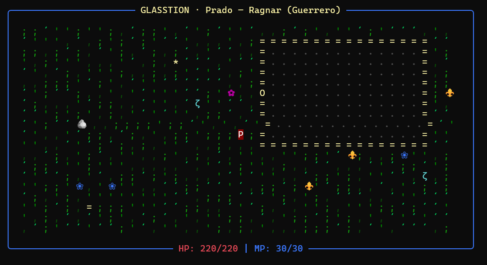
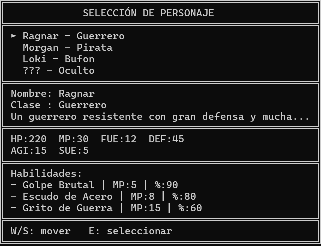
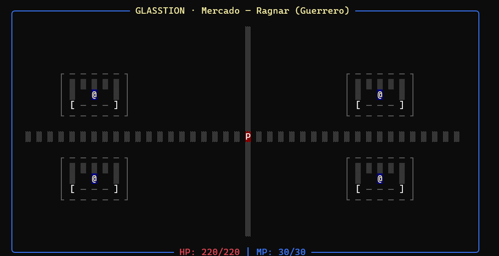
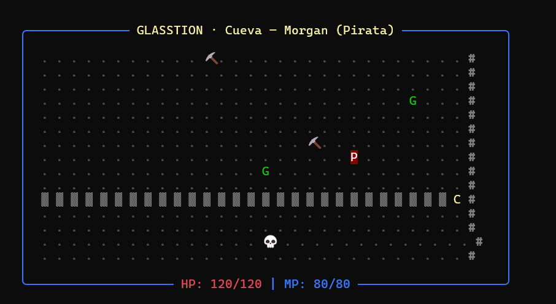
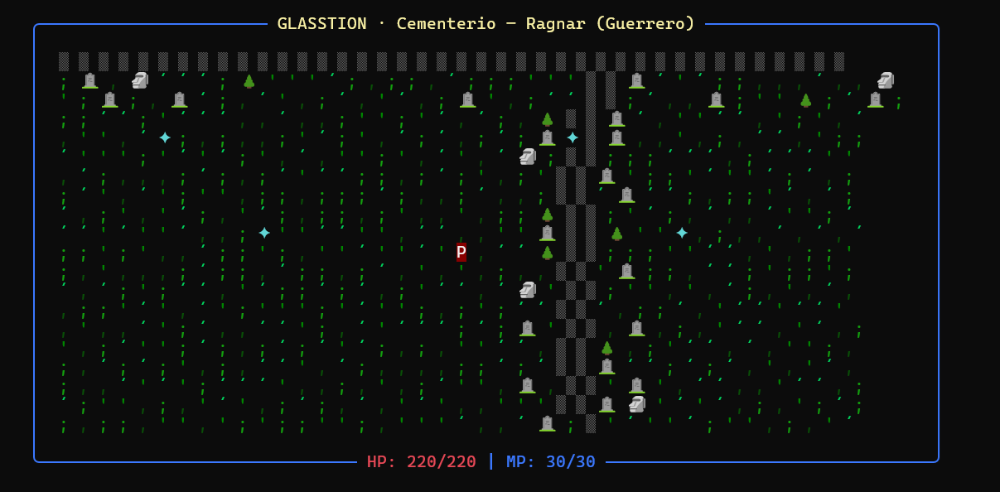
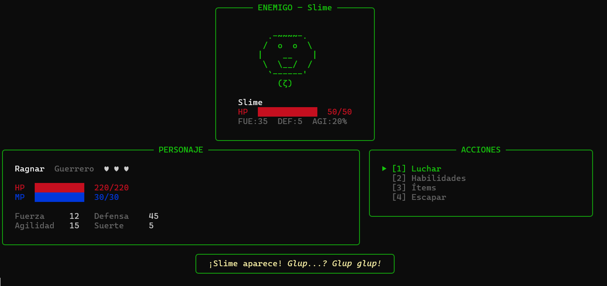
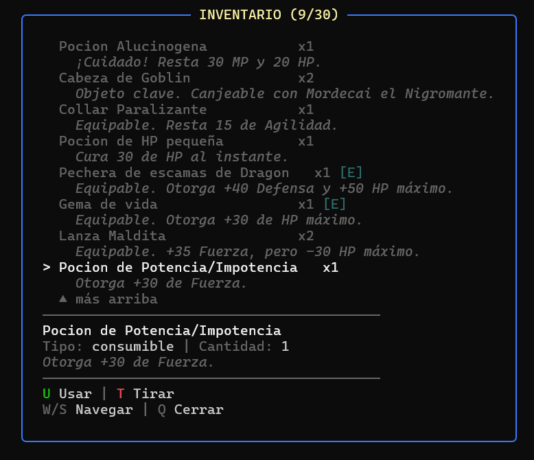
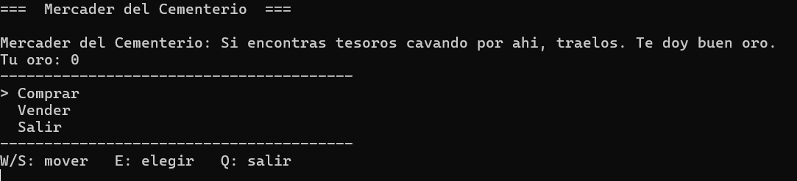
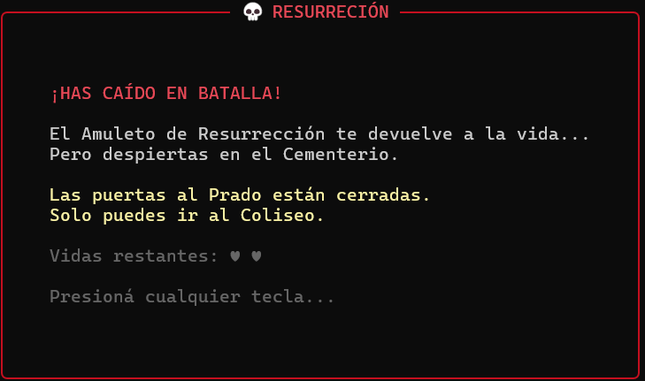
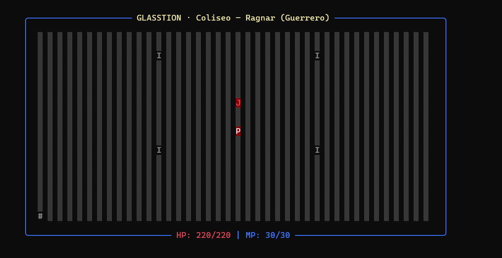

<p align="center">
  
</p>

<h1 align="center">⚔ GLASSTION</h1>

<p align="center"><b>Un RPG de terminal donde todo pasa con texto, color y un poco de locura.</b></p>

Glasstion es un juego de rol hecho entero para la consola. Elegís un héroe, salís a recorrer un mundo armado con caracteres, peleás contra bichos por turnos, recolectas objetos estrategicamente y, si sos lo bastante valiente (o terco), llegás al Coliseo. Nada de gráficos 3D ni cosas que se le parezcan: solo vos, el teclado y un montón de símbolos que cobran vida.

<br>

## 🧙 Elegí tu héroe

Tres personajes para empezar, cada uno con su manera de pelear... y un cuarto que vas a tener que ganarte.

- **Ragnar (Guerrero):** aguanta de todo. Mucha vida, mucha defensa y golpes que se sienten.
- **Morgan (Pirata):** fuerte e impredecible. Pega justo cuando menos lo esperás.
- **Loki (Bufón):** rápido y escurridizo. Pelea con trucos más que con músculo.
- **??? (Oculto):** hay un cuarto personaje. No te vamos a decir cómo se desbloquea.

<p align="center">
  
</p>

<br>

## 🗺️ Un mundo para recorrer

Cinco lugares, cada uno con su clima:

- **El Prado:** pasto, flores y enemigos sueltos. El punto de partida, donde aprendés a moverte.
- **El Mercado:** cuatro puestos y comerciantes con cosas para ofrecerte, si te alcanza el oro.
- **La Cueva:** oscura, con goblins escondidos y picos abandonados. No estás solo ahí adentro.
- **El Cementerio:** tumbas, silencio y un mercader que te compra lo que desentierres. Da un poco de cosa.
- **El Coliseo:** la arena final. Acá se viene lo bueno.

<p align="center">
  
</p>
<p align="center">
  
</p>
<p align="center">
  
</p>

<br>

## ⚔ Combate por turnos

Cuando te cruzás con un enemigo, arranca la pelea. Podés **luchar**, tirar una **habilidad**, usar un **ítem** o, si la cosa se pone fea, intentar **escapar** (no siempre sale). Cada clase tiene sus propias habilidades y cada enemigo su forma de hacerte la vida difícil.

<p align="center">
  
</p>

<br>

## 🎒 Objetos con personalidad

Tu mochila se llena de cosas, y no todas son lo que parecen. Pociones que curan, pociones que te arruinan, armas malditas que pegan más fuerte pero te dejan más débil, y objetos clave que solo sirven con la persona correcta.

> *Lanza Maldita: +35 de Fuerza, pero -30 de HP máximo.*
>
> *Cabeza de Goblin: canjeable con Mordecai el Nigromante.*

<p align="center">
  
</p>

<br>

## 👤 Personajes enigmaticos por conocer

El mundo está lleno de personajes con los que podés hablar. Algunos te cuentan cosas, otros te mandan a buscar lo que se les perdió, y un mercader medio siniestro te paga en oro por los tesoros que saques de las tumbas.

<p align="center">
  
</p>

<br>

## 💀 Una vida no alcanza

Morir no siempre es el final. Un Amuleto de Resurrección te puede devolver a la vida, pero cada caída tiene su precio. Cuidá tus vidas, que no son infinitas.

<p align="center">
  
</p>

<br>

## 🏆 El Coliseo

Si llegás hasta acá, preparate. En la arena te esperan tus rivales y la pelea que lo define todo. No hay vuelta atrás.

<p align="center">
  
</p>

<br>

## 🎮 Para jugarlo

Se juega con el teclado, en la consola. Te movés, hablás, peleás y elegís opciones de los menús con las teclas. Podés guardar tu partida y seguir después desde donde la dejaste.

```
python main.py
```

<br>

## El equipo

Hecho por:

- Franz Acevedo
- Juan Colonia
- Tomas Perez
- Facundo Zambrana
